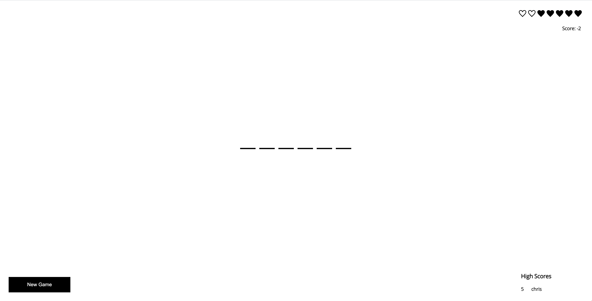
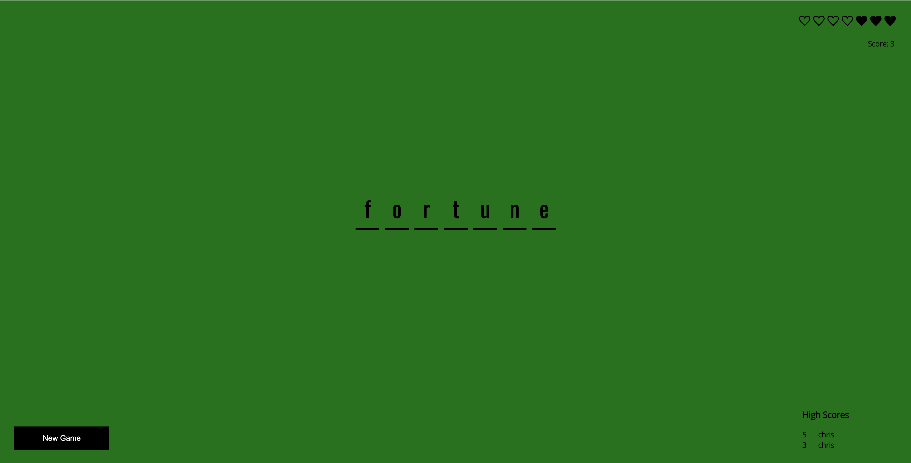
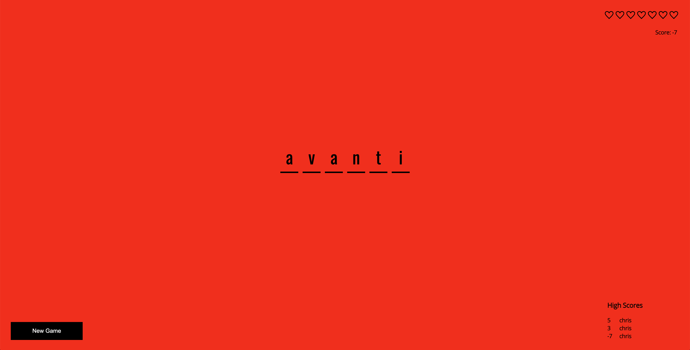
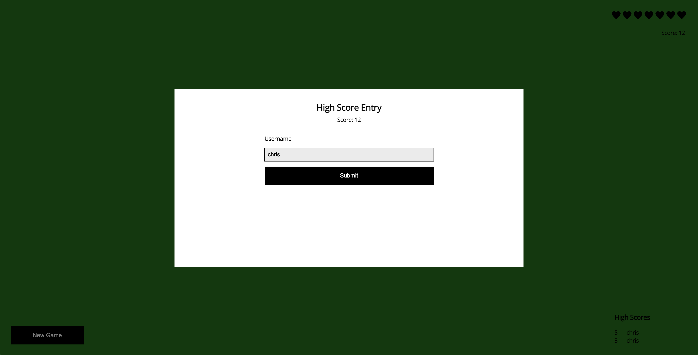

# Avanti Front-end Takehome

For this assignment you will be working on the game hangman as a single page application. The finished product will look like this:



Some of the game has already been done; however, Paul who was working on the project has decided to pursue a career in botany after watching "The Martian." We need your help in finishing the project.

## Development notes

You will need Node.js and Yarn installed locally. This project uses Yarn workspaces, using `npm` will not work.

### Install yarn

```sh
npm install -g yarn
```

### Install modules

```sh
yarn install
```

### Run application

```sh
cd apps/hangman && yarn start
```

Open browser and visit `http://localhost:4000`.

### Additional Information

- For the purposes of this project, there is no backend. This is just a single page application. All data is handled either in a redux action or a redux reducer.
- If you are not familiar with TypeScript and you are getting a type error from any code that you add, please just set the type as `any` and if you have more time at the end try to resolve the type.

## Requirements

We've made a list of features and bugs that need to be addressed. Please do as much as you can in a four hour timeframe.

### Bug Set 1

1. The game is on the route `/game`, can you make sure that any requests to `/` will redirect the user to `/game.`
2. Data for a new game is not loading; can you check to see why the app doesn’t see the new data?
3. App complains about a required `key` is missing. It doesn’t seem to break the app but is it worth looking into?
4. When a user makes a char guess with their keyboard, the app doesn’t do anything.
5. Number of guesses is not incrementing. Please have it increment once per character guess.
6. When a user makes an incorrect guess, the hearts should go empty one at a time (they are kinda like Zelda-style hearts but only full or empty). Right now the hearts stay full.

### High Score Feature

7. When the user has either won the game or lost the game, determine if they had a high score and if so show them the modal (which you need to create) to allow them to submit a high score with their username. See the last screen shot for an example. If the user plays multiple games, the modal should be populated with their username after they enter it the first time.
8. The high score list needs to update after a user submits a score.
9. The high score list should be sorted so that the highest positive score is first.

### Bug Set 2

10. When a game is finished, the game’s background color is supposed to change to green if the user won, and red if the user lost.
11. `Oswald` font family is missing, but is supposed to be used to render the hangman character guesses.
12. Only fade in the correct character the first time it is rendered. Otherwise it should stay still. I think we have a fade in component somewhere...

To submit the assignment, please `.zip` up the codebase and email back. Feel free to delete `.yarn/cache` to make the `.zip` size smaller.

## Additional Screenshots

Here is what the app should look like in the win, lose, and high score scenarios:

### Win



### Lose



### High Score


